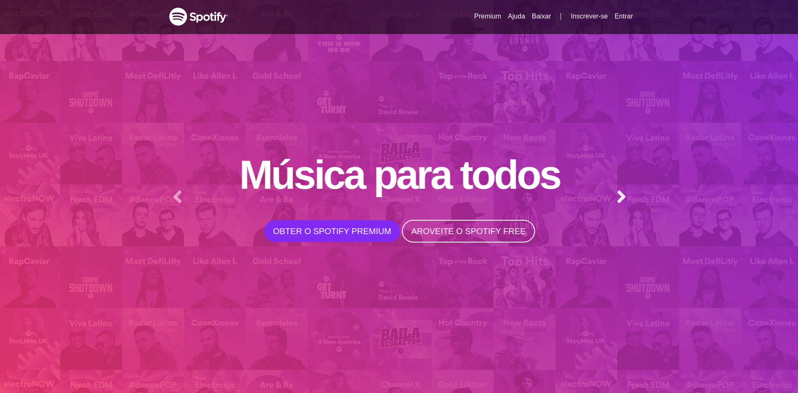
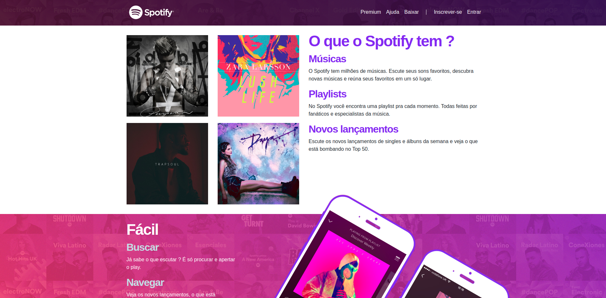

<h1>Spotify Clone</h1>
---

Neste repositório está contido um clone da interface home do Spotify Web. O projeto em sí traz uma interface identica ao home do Spotify e possui um layout totalmente responsivo e funcionando em diversos dispositivos.

O projeto foi realizado utilizando apenas as tecnologias de HTML/CSS com o Bootstrap 4.

<h1>Responsividade</h1>
---

O projeto foi adaptado para funcionar em diversos dispositivos, e possui um layout totalmente responsivo.

<h1>Créditos</h1>

Esse clone foi realizado com a ajuda do professor Jamilton Damasceno no seu curso da Udemy de programação e desenvolvimento web.
